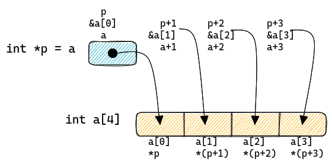
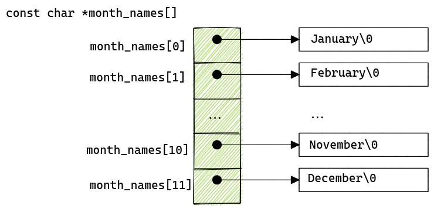

[//]: tocstart
Table of Contents
-----------------
* [Arrays and Pointers](#arrays-and-pointers)
  * [Arrays](#arrays)
    * [Size vs. Length](#size-vs.-length)
  * [Pointers](#pointers)
    * [Relationship to Arrays](#relationship-to-arrays)
    * [Pointer Arithmetic](#pointer-arithmetic)
  * [Strings](#strings)
  * [Arrays of Pointers](#arrays-of-pointers)

[//]: tocend

# Arrays and Pointers

Pointers and arrays are strongly related in C, enough that they are usually
discussed at the same time.

## Arrays

An **array** is an object that holds a contiguous set of a certain type.  Any
defined type (built-in or user-specific) may be declared as an array.

The declaration:
```c
int a[10];
```
declares a block of 10 consecutive `int` objects in memory, accessed using:
`a[0]`, `a[1]`, ... `a[9]`.

An array can also be declared with an implied size determined by the initialization:
```c
int a[] = {0, 1, 2, 3, 4, 5, 6, 7, 8, 9};
```

### Size vs. Length

The size of an array (i.e. the amount of bytes in memory, an array takes), is
the size of the base type * the number of elements. In the case of `a[10]` above,
this would be `sizeof(int) * 10`, or 40 bytes (since `sizeof(int)` = 4).

> **Note**: 
> The `sizeof()` operator yields the number of bytes required to store an object
> of the type of its operand. When applied to an array, the result is the number
> of *bytes* in the array, **not** the number of elements of the array.  Thus,
> using the example above `sizeof(a)` yields 40, not 10.

On the other hand, the *length* of an array is typically taken to mean the
number of elements in an array. We can use a macro such as below to determine
the number of elements in an array:

```c
#include <stdint.h>  // for uint16_t

#define ARRAY_LENGTH(name)    (sizeof(name)/sizof(name[0]))

/* Declare an array of 12 u16s (24 bytes total). */
uint16_t myArray[12];

/*  Declare a variable to hold the number of elements in myArray.
    sizeof(myArray) = 24      (since an array of 12 u16's)
    sizeof(myArray[0]) = 2    (since each element is a u16)
    sizeof(myArray)/sizeof(myArray[0]) = 12
*/
unsigned int num_items = ARRAY_LENGTH(myArray);
```

## Pointers

A **pointer** is a variable that contains the address of some object in memory
and is usually represented as 4 bytes.

Consider the following declarations:

```c
unsigned int data = 100;
unsigned int *pData;
```

- The first declaration, creates an object in memory named `data`, sets aside 4
bytes to hold its value and then loads the value 100 into the memory designated.

- The second, creates a *pointer* that can reference an `unsigned int` type.  It
is not useful yet, since it does not point to anything.

We now introduce the `&` operator.  When placed before the name of a
variable, the `&` means "address of" the following variable. To see how this
works, let's assign our pointer declared above:

```c
pData = &data;
```

This sets the value of `pData` to be the "address of" the variable `data`. If we
were to inspect the value of `pData` in a debugger, we would see something like
`pData = 0x80251000`.  The value of the pointer is wherever the compiler placed
the object `data` in memory. This value itself is not altogether useful, just
that it represents a address in the computer's memory.

Now that our pointer actually points to a real object, how can we obtain the
value of the original object with the pointer? The unary operator `*` is called
the *indirection* or *dereferencing* operator. When applied to a pointer, it
accesses the object the pointer points to.

```c
/* De-reference the pointer to obtain the pointed-to object's value. */
printf("The orignal value is %u\n", *pData);
```

The result would be: `"The original value is 100"`

> **Note**:
> With pointers, the interpretation of `*` is based on the context of its use:
>
> > When used in a declaration following the type, read it as "pointer to" the
> > type.  
> > For example: `unsigned int *` -> interpret as "*pointer to* `unsigned int`"
> 
> > When used in an expression, interpret as *de-referencing*.>
> > For example: `x = *pData;` -> interpret as `x = the value referenced by pData`"


### Relationship to Arrays

Arrays and pointers are closely coupled.  

Consider the following code snippet:

```c
int a[4] = {0, 1, 2, 3};
int *p;

p = &a;
```

Below are a few identities to be aware of:

1. The name of an array by itself is a pointer to the array.
    * `a` without any brackets can be thought of as having type `int *`
2. The address of the first array element is equivalent to a pointer to the
   array. 
    * That is, `&a[0] == p`
3. The following are equivalent ways to access array elements:
    * `a[0]` is equiv. to `*(p + 0)`
    * `a[1]` is equiv. to `*(p + 1)`
    * `a[2]` is equiv. to `*(p + 2)`
    * `a[3]` is equiv. to `*(p + 3)`
    * `a[p]` is equiv. to `*(p + r)`  (for r <= 3)

The equivalence is shown graphically below:
[]

### Pointer Arithmetic

When you declare a variable as a pointer, it is constrained to point to a
specific type. The compiler inherently knows how to perform arithmetic on the
pointer.  

Examples: Let 

```c
/* Declare an integer, x */
int x;
/* Declare a pointer to an integer. */
int *ip;

/* Initialize x */
x = 0;

/* Set the pointer to point to x. */
ip = &x;
```

Each of the following increments the target *pointed to* by `ip` (i.e. `x`) by 1:

```c
*ip = *ip + 1;
*ip += 1;
++*ip;
(*ip)++;
```

The last example is interesting since it requires the ( ) around `*ip`. This is
because unary operators such as `*` and `++` associate right to left.  Without
the parenthesis, the expression `*ip++` would increment the pointer `ip` instead
of what it points-to.

Now, let's assume again we have the following array and pointer assignments as
above:

```c
int a[4] = {0, 1, 2, 3};
int *p;

p = &a;
```

Consider the operation:
```c
p += 2;
```

The pointer `p` has been advanced to point to the 3rd element of the array
`a`.  That is, the compiler, knowing that `a` is of type `int`, knows that each
element consumes 4 bytes of memory. Therefore, operations on the pointer to an
object use the size of the object as a multiplier.

Here are two equivalent functions for returning the sum of an integer array:

```c
/* Using array subscripting */
int sum(int *input, int array_len)
{
    int sum_out = 0;
    int i;
    for (i = 0; i < array_len; i++)
    {
        sum_out += input[i];
    }
    return sum_out;
}
```

```c
/* Using pointers */
int sum(int *input, int array_len)
{
    int sum_out = 0;
    int i;
    for (i = 0; i < array_len; i++)
    {
        sum_out += *(input + i);
    }
    return sum_out;
}
```

## Strings

A string is simply another name for an array of type `char`. However, a string
implies that the contents are printable characters. In C, strings constants are
handled differently than normal integer-type constant arrays.

A string constant declared as follows
```c
char str[] = "Hello world!";
```
Internally is represented as the individual characters: 
`['H', 'e', 'l', 'l', 'o', ' ', 'w', 'o', 'r', 'l', 'd', '!', '\0']`

Note the last character, `\0'`. This called the *null* character. It is used to
terminate strings (strings in C are referred to as 'null-terminated'). This
allows string processing functions (`strlen`, `strcpy`, `strcat`, etc...) to
determine when the end of a string has been reached. Without the null
termination, string processing functions will happily increment away into
whatever memory happens to resided adjacent to a string until it comes across a
0 memory value. Here is a simple implementation of `strcpy` as an example:

```c
void strcpy(char *dest, char *src)
{
    /* Loop until the source points to the null-character. */
    while (*src != '\0')
    {
        /* Copy a character */
        *dest = *src;
        /* Increment the pointers */
        dest++;
        src++;
    }
}
```

Consider the following two apparently equivalent ways of declaring and initializing a string:

```c
char message[] = "This is a message.";
char *message = "This is a message.";
```

There are notable differences:
1. `char message[] = "...";` The compiler creates a writable array of a size
   just enough to hold the string plus the terminating `\0'`. The initialization
   characters are copied into the array when the program starts.

2. `char *message = "...";`  Creates an anonymous array of `char`. Any attempt
   to modify the array has undefined behavior (this is bad). The characters in
   the array could be stored in RAM or ROM (i.e. flash, if on an embedded
   processor) - it is at the whim of the compiler. Worse yet, the compiler is
   under no obligation to warn you about this. The fix is explicitly telling the
   compiler that this is a read-only array. This is accomplished with the
   `const` qualifier:

```c
const char *message = "Warn me if I try to change this string.";
```

If you attempt to modify `message` via the pointer, the compiler will at least
warn you about it.

## Arrays of Pointers

Since pointers are just themselves variables, you can also declare an array of
pointers. The most common use case of this is with an array of strings. As an
example, let's consider declaring an array of string constants for the months of
the year:

```c
const char *month_names[] = {
    "January", "February", "March", "April", "May", "June", "July", "August",
    "September", "October", "November", "December"};
```

This declares an array of `char *` pointers where each array element points to
one of the string constants in the array.

[]

```c
char *month;

month = month_names[11];
printf("The month is %s\n", month);
```
Prints `The month is December`.
